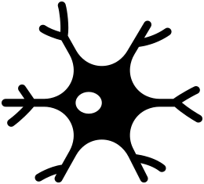

<!-- omit in TOC -->

# axon

Port of Neuron from Haskell to Rust with additional features

* [Matrix room Axon](https://app.element.io/#/room/#axon-rs:matrix.org)
* [Zulip stream Axon](https://glottologist.zulipchat.com/#narrow/stream/258643-axon-rs)

[docs]: https://docs.rs/axon-rs
[examples]: examples
